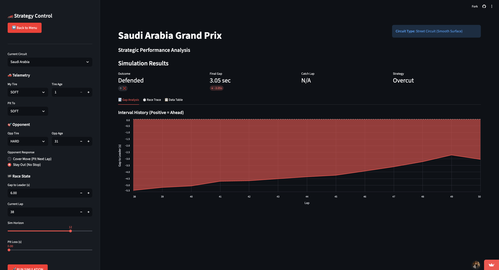
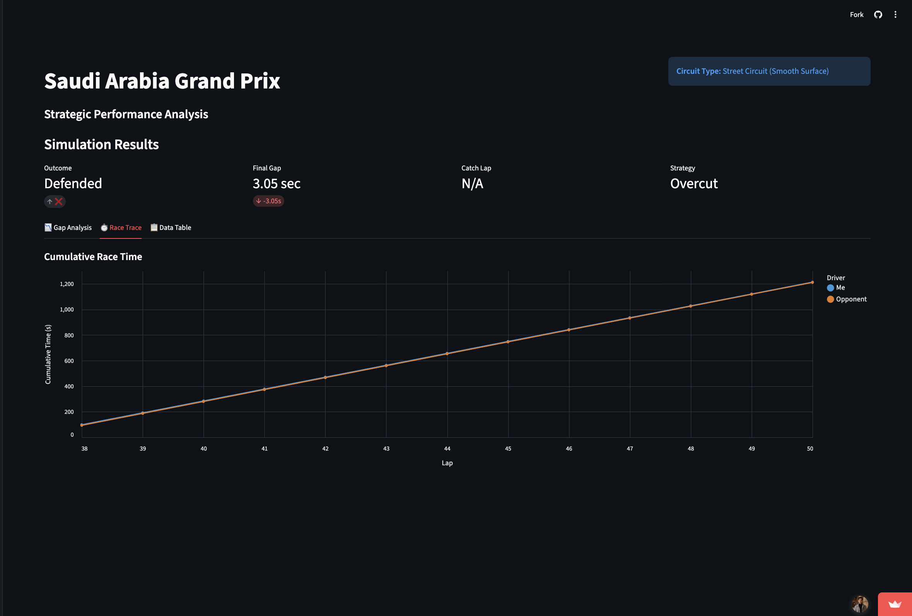
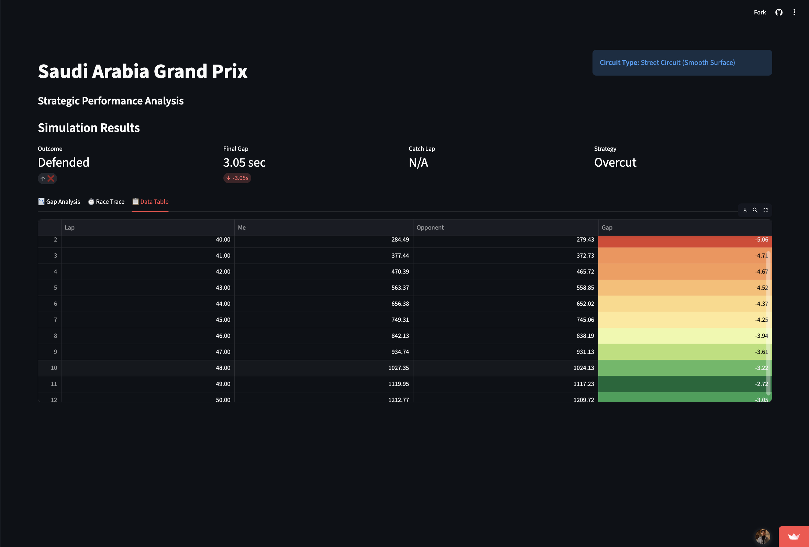

# 🏎️ F1 Strategy Control: ML Race Simulation Engine

**A Machine Learning application that predicts Formula 1 tire degradation and simulates real-time strategic race scenarios using Random Forest regression.**

[**View Live Demo**](https://formula-one-strategy-control.streamlit.app/)

---

## 1. Project Overview

In Formula 1, race strategy is a complex optimization problem involving physics, probability, and human psychology. Teams like Red Bull Racing Team, Mercedes Formula One Team, and other successful teams use bespoke software to answer one critical question: **"If we pit now, where will we finish?"**

This project reverse-engineers that capability. It ingests historical telemetry data, trains distinct ML models for different track surfaces, and provides a "Pit Wall" interface to simulate future race outcomes.

### The Problem (For Non-F1 Context)
Race cars face two opposing forces during a Grand Prix:
1.  **Fuel Burn:** As the car consumes fuel, it becomes lighter and theoretically faster.
2.  **Tire Degradation:** As tires wear out, grip reduces, and the car becomes slower.

Strategy is the art of deciding when to trade "Track Position" (time lost stopping in the pits) for "Tire Pace" (speed gained on fresh rubber). This tool quantifies that trade-off.

---

## 2. System Architecture

The application is built on a modular data pipeline:

### Data Ingestion & Engineering
* **Source:** Telemetry data is pulled via the FastF1 API (lap times, tire compounds, tire age, track status).
* **Cleaning:** Data is filtered to remove outliers (Safety Car laps, In/Out laps) to ensure the model learns only "Green Flag" racing pace.
* **Feature Engineering:** Features include `TireAge`, `Compound` (Soft/Medium/Hard), and `LapNumber` (proxy for fuel load).

### The Machine Learning Core
The system uses **Random Forest Regression** (`sklearn.ensemble.RandomForestRegressor`) rather than simple linear regression.
* **Why Random Forest?** Tire degradation is non-linear. Tires often hit a "cliff" where performance drops suddenly. Decision trees capture these non-linear thresholds better than linear models.
* **Multi-Model Approach:** A single model cannot generalize across all circuits. The system trains specific "Brains" (pickled models) for distinct track profiles:
    * **Bahrain:** High Degradation (Abrasive surface).
    * **Saudi Arabia:** Low Degradation (Smooth street circuit).
    * **Monza:** Low Downforce (High speed).
    * **Japan:** The 'Figure-8' layout has many fast corners. This puts sideways energy into the tires, causing high wear (Technical).

### The Simulation Engine (Inference)
The app runs a forward-looking simulation (Monte Carlo-lite) based on user inputs. It projects lap times for both the user (Chaser) and the opponent (Leader) over a set horizon to determine if/when an overtake will occur.

---

## 3. Model Validation: Case Study

To verify the accuracy of the underlying physics engine, the model was tested against a complex real-world scenario from the **2024 Saudi Arabian Grand Prix**.

### Scenario: The Bearman Defense
* **Context:** Rookie Oliver Bearman (Ferrari) was leading Lando Norris (McLaren) with 12 laps to go.
* **The Physics Challenge:** Norris was on **Brand New Soft Tires** (fastest theoretical pace). Bearman was on **30-lap-old Hard Tires** (slowest theoretical pace).
* **The Question:** Could Norris catch and pass Bearman before the race ended?

### Simulation Setup
We fed the model the exact variables from Lap 38 of the race:

| Parameter | Input Value | Context |
| :--- | :--- | :--- |
| **Track** | Saudi Arabia | Loads low-degradation physics model. |
| **Chaser (Lando Norris)** | Soft Tires (Age 1) | Attempting to chase down the leader. |
| **Leader (Oliver Bearman)** | Hard Tires (Age 31) | Trying to survive on old rubber. |
| **Gap** | 6.0 Seconds | The physical distance between cars. |
| **Strategy** | Stay Out | Bearman does not pit. |

### Results: Simulation vs. Reality

**Gap Analysis Display:**
 

**Race Trace:**
 

**Data Table (showing gap to the leader):**
 


* **Prediction:** The simulation showed Norris closing the gap rapidly for 4 laps, but then stalling as his Soft tires overheated. The model predicted Norris would finish **3.05 seconds behind**.
* **Real World Result:** Lando Norris failed to catch Bearman and finished **2.70 seconds behind**.
* **Accuracy:** The model correctly identified the specific low-degradation characteristics of the Jeddah circuit. On a high-wear track like Bahrain, the model calculates that Norris would have easily overtaken; but in Saudi Arabia, it correctly predicted the defense would hold.

---

## 4. Tech Stack

* **Language:** Python 3.12
* **Frontend:** Streamlit (Custom CSS for dashboard UI)
* **Machine Learning:** Scikit-Learn
* **Data Processing:** Pandas, NumPy
* **Data Source:** FastF1 API
* **Visualization:** Altair

## 5. Local Installation

To run this strategy engine on your local machine:

1.  **Clone the repository**
    ```bash
    git clone [https://github.com/chapagaiaashray/f1-strategy-control.git](https://github.com/chapagaiaashray/f1-strategy-control.git)
    cd f1-strategy-control
    ```

2.  **Create a virtual environment**
    ```bash
    python -m venv venv
    source venv/bin/activate  # On Windows: venv\Scripts\activate
    ```

3.  **Install dependencies**
    ```bash
    pip install -r requirements.txt
    ```

4.  **Train the models** (This downloads 2024 data and generates .pkl files)
    ```bash
    python train_model.py
    ```

5.  **Launch the dashboard**
    ```bash
    streamlit run app.py
    ```

---

*Note: This project is for educational and portfolio purposes. It uses open-source telemetry data and is not affiliated with Formula 1 or any specific racing team.*
